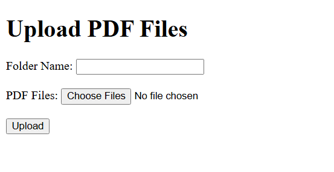
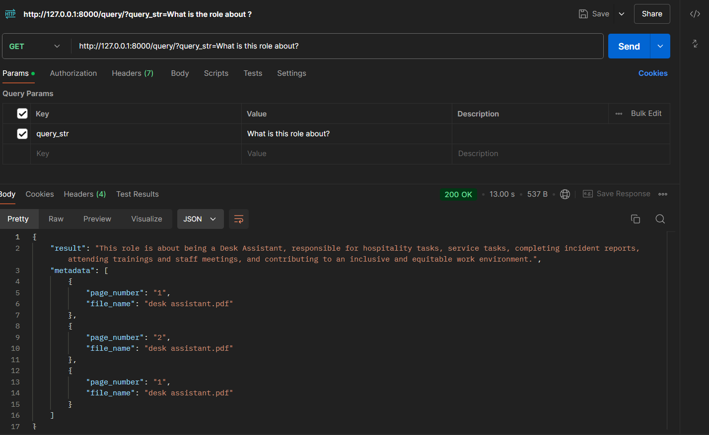

## RAG Chatbot with FASTAPI      

A sophisticated conversational AI system built using Retrieval-Augmented Generation (RAG) architecture, combining the power of large language models with precise information retrieval capabilities.

## 🌟 Overview     

This chatbot leverages RAG (Retrieval-Augmented Generation) architecture to provide accurate, context-aware responses by combining dynamic information retrieval with natural language generation. Unlike traditional chatbots, this system can access and utilize specific documents and knowledge bases to generate informed, up-to-date responses from your own Document.

## 🚀 Key Features    

1.) Intelligent Document Retrieval: Uses embeddings and vector databases to locate precise information within personal document collections.   

2.) Context-Aware Generation: Leverages LLMs to generate responses grounded in the specific content of personal documents.    

3.) Open-Source Integrations: Utilizes open-source tools and APIs, like LangChain and LLamaIndex, for document indexing and retrieval, and HuggingFace embeddings for semantic search.   

4.) Secure & Private: Ensures all document processing remains secure, making it ideal for private or proprietary data use cases.    

## 🛠️ Technical Architecture
       
1.) LLM = Gpt-3.5-turbo  
2.) Embeddings = BAAI/bge-large-en-v1.5   [Check the Rankings From the MTEB Leaderboard for the Embeddings](https://huggingface.co/spaces/mteb/leaderboard)  
3.) Vector Storage: Simple Vector Storage ( Can use any like Qdrant, Pinecone, ChromDB etc)  
4.) Re-Ranker = BAAI/bge-reranker-large   [Check the Rankings From the MTEB Leaderboard for Retrieval](https://huggingface.co/spaces/mteb/leaderboard)  
5.) FastAPI for integrating the chatbot into web applications
[It Only Takes PDF as Input as of Now]

## 💡 Use Cases  

1.) Enterprise Knowledge Base: Access and query internal documentation  
2.) Customer Support: Provide accurate responses based on product documentation  
3.) Educational Systems: Deliver precise information from learning materials  
4.) Documentation Assistant: Help users navigate through technical documentation  
5.) Research Assistant: Aid in analyzing and retrieving information from research papers  

## ⚙️ Setup and Configuration
1. Install the required packages using pip: pip install -r requirements.txt
2. Configure the environment variables in .env file. (Provide the Openai API) else you can also use the Open Source LLMs using Ollama.
[Read the Blog Here for How To Run Opensource LLM on your Local PC Using Ollama](https://medium.com/@infinityai/how-to-run-llama3-phi3-on-your-local-pc-using-ollama-b84213b2960a) 
3.) Run the Together.py Python File     

## 🪜 How to Use  

Run the Together.py File : 
1. Execute Together.py to open the web interface in your browser.  
2. Use the interface to upload one or more PDF files by specifying a folder name containing all the files you wish to upload.

Submit Queries via Postman:
1. Once the files are uploaded, open Postman.
2. Enter your query, and the chatbot will retrieve and respond with relevant information from your uploaded documents.
3. 🏃🏻 Run the Together.py File, it will Open the Web Browser, to upload the Any files. it can be more than one, just simply proviode the Folder name and All the Files.

## 📸 Screenshots:   

1.) web Interface ( Upload PDF )

2.) Postman Interface (Submit Query)

